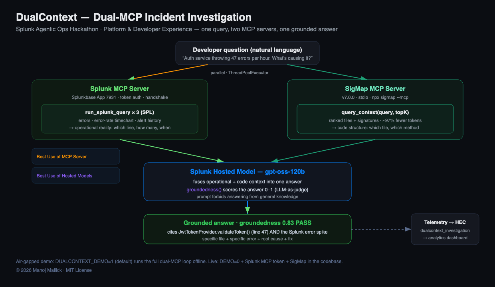

# DualContext — Dual-Context Incident Investigation for Developers

<!-- Context -->
<p>
  
  
  
</p>

<!-- Technology stack -->
<p>
  
  
  
  
  
</p>

<!-- Status -->
<p>
  
  
  
  
</p>

> **Splunk Agentic Ops Hackathon · Platform & Developer Experience track**
> *Production incident. Two contexts. One answer.*

When production breaks, a developer needs two kinds of intelligence at once:
**operational context** (what Splunk sees — errors, metrics, anomalies) **and
code context** (which file, which method, what changed). Today they switch
between the Splunk dashboard and the IDE/GitHub — two tools, mental overhead.

**DualContext** wires the **Splunk MCP Server** and the **SigMap MCP Server**
together. One developer query fans out to both in parallel, a Splunk hosted
model fuses the results, and you get a grounded answer that cites **a specific
log entry AND a specific code location** — with a groundedness score attached.

---

## Why this is the strongest Platform submission

Most submissions use one MCP server. DualContext composes **two** — Splunk's
official MCP Server for operational reality, and SigMap's MCP Server for code
structure. Neither source alone is sufficient:

- **Splunk alone:** "NullPointerException at line 47" — *which file?*
- **SigMap alone:** "`JwtTokenProvider.validateToken()`" — *which error?*
- **Together:** specific file + specific error + root cause + fix.

| Capability | Where | Prize relevance |
|---|---|---|
| **Splunk MCP Server** | `splunk_mcp.py` — agent queries Splunk via MCP/JSON-RPC | *Best Use of Splunk MCP Server* |
| **Splunk Hosted Models** | `synthesizer.py` — `gpt-oss-120b` fuses both contexts **and** scores groundedness (LLM-as-judge) | *Best Use of Splunk Hosted Models* |
| **SPL via `run_splunk_query`** | `splunk_mcp.py` — errors, error-rate, alerts as SPL | Platform depth |
| **SigMap MCP Server** | `sigmap_mcp.py` — `query_context` over stdio | Unique composition |

> **Real tools only — verified against the live servers.** The Splunk MCP Server
> exposes `run_splunk_query`, `generate_spl`, `get_indexes`, … (Splunkbase App ID
> 7931); errors/metrics/alerts are all SPL because it has one query tool, not
> three. The SigMap MCP Server (v7.0.0) exposes `query_context`,
> `search_signatures`, `explain_file`, `get_impact`, … — DualContext uses
> `query_context` for relevance ranking. SigMap has **no** groundedness-judge
> tool, so the Splunk hosted model scores groundedness.

---

## About SigMap — and why DualContext uses it

**SigMap** → **[github.com/manojmallick/sigmap](https://github.com/manojmallick/sigmap)**
(runs as an MCP server: `npx sigmap --mcp`)

SigMap is an open-source **code-structure MCP server** I built. Pointed at a
repository, it indexes the codebase into ranked *signatures* — classes, methods,
and their relationships — and exposes them over the Model Context Protocol. Given
a natural-language query, `query_context` returns just the handful of
files/methods relevant to that query, with their signatures, instead of the whole
repo.

**Why DualContext needs it — the missing half.** Splunk tells you *what* broke and
*where in the running system* (error, line, rate, service). It cannot tell you
*which file and method* in your source owns that error. An incident answer needs
both. SigMap supplies the code half:

- **Operational reality** (Splunk MCP) → `NullPointerException at line 47, 8× baseline`
- **Code structure** (SigMap MCP) → `JwtTokenProvider.validateToken() → getUsernameFromToken() may return null`
- **Fused** (Splunk hosted model) → specific file + specific error + root cause + fix

**Why SigMap specifically, and not "just send the repo":**

1. **Token efficiency — ~97% reduction.** Shipping a whole repo to a model is
   slow, expensive, and dilutes attention. SigMap returns only query-relevant
   signatures (~180 tokens in the demo vs ~45k for the full codebase), which keeps
   the Splunk hosted-model prompt small, fast, and cheap — and makes the answer
   *more* grounded, not less.
2. **MCP-native — clean composition.** SigMap speaks the same protocol as the
   Splunk MCP Server, so DualContext composes *two MCP servers* behind one agent
   with no bespoke glue. That dual-MCP composition is the core idea of this
   submission.
3. **Structure over text search.** It ranks by code structure and relevance, not
   substring matching — so it surfaces the *method that returns null*, not every
   file that mentions "token".

**Honest disclosure.** SigMap is my own open-source project, used here purely as
the code-context provider (the `query_context` tool). It does **not** score
groundedness — that is done by the Splunk hosted model in `synthesizer.py`, so the
Splunk capabilities remain the protagonists of this submission.

---

## Run it (zero network, ~1 second)

```bash
cd dualcontext
python demo.py
python demo.py --query "Payment service timing out. Why?"
```

`demo.py` fans the question out to the (simulated) Splunk MCP + SigMap MCP
servers **in parallel**, fuses both with a Splunk hosted model, and scores the
answer. **No Splunk instance or API key required** — `DUALCONTEXT_DEMO=1` is the
default (CLAUDE.md air-gapped rule). Secrets come only from the environment and
are masked in output (`Config.mask_token`).

### Against a live Splunk instance + SigMap

```bash
export DUALCONTEXT_DEMO=0
export SPLUNK_MCP_URL=...        SPLUNK_MCP_TOKEN=...
export SPLUNK_HOSTED_MODEL=gpt-oss-120b
export DUALCONTEXT_CODEBASE=/path/to/spring-security-samples   # SigMap runs here
pip install -r requirements.txt
python demo.py
```

Production Splunk path: the **Splunk MCP Server on Splunkbase (App ID 7931)**,
token auth (OAuth in Controlled Availability). Local demo path: the standalone
`splunk/splunk-mcp-server2`. SigMap runs as `npx sigmap --mcp` in the codebase.

---

## Architecture



```
            developer query
                  │
      ┌───────────┴───────────┐   (parallel — ThreadPoolExecutor)
      ▼                       ▼
 Splunk MCP Server      SigMap MCP Server
 run_splunk_query ×3    query_context
 (errors, rate, alerts) (ranked file/method signatures)
      │                       │
      └───────────┬───────────┘
                  ▼
        Splunk hosted model (gpt-oss-120b)
        fuses both contexts + scores groundedness
                  │
                  ▼
        grounded answer + groundedness score (PASS/FAIL)
```

## Repository layout

```
dualcontext/
├── dualcontext/
│   ├── config.py        env-only secrets, thresholds, demo mode
│   ├── splunk_mcp.py    Splunk MCP client — operational context (run_splunk_query)
│   ├── sigmap_mcp.py    SigMap MCP client — code context (query_context)
│   ├── synthesizer.py   Splunk hosted model (gpt-oss-120b) fuses both sources + judges
│   └── agent.py         the dual-MCP agent  ← the core
├── demo.py              runnable end-to-end demo (no network)
└── mcp-config.json      both MCP servers, ready to drop into an MCP client
```

## Honest status

This is a hackathon MVP. The **demo runs end-to-end offline** with deterministic
data modelled on `spring-security-samples`. The live paths (Splunk MCP over
streamable-HTTP JSON-RPC, SigMap over stdio JSON-RPC, hosted-model synthesis)
are implemented and gated behind `DUALCONTEXT_DEMO=0`; numbers shown in the demo
(e.g. groundedness 0.83, 99.6% token reduction) are illustrative single-run
values, not aggregate production metrics.

---

**DualContext** · Splunk MCP + SigMap MCP · built for the Splunk Agentic Ops Hackathon
· [github.com/manojmallick/dualcontext](https://github.com/manojmallick/dualcontext)

*© 2026 Manoj Mallick · MIT License*
