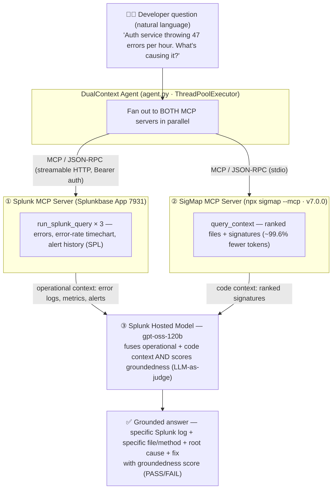

# DualContext — Architecture Diagram

> Splunk Agentic Ops Hackathon · **Platform & Developer Experience** track
> One developer query → two MCP servers in parallel → Splunk-hosted-model synthesis → grounded answer.



## Required elements

### (a) Interaction with Splunk
- **Splunk MCP Server (App 7931)** is the primary integration. The agent reads operational
  reality through the real `run_splunk_query` tool over MCP/JSON-RPC (Bearer-token auth;
  OAuth in Controlled Availability). Errors, the error-rate `| timechart`, and alert history
  (`index=_audit`) are all expressed as **SPL**, because the server exposes one query tool.
- **Splunk Hosted Model (`gpt-oss-120b`)** is the synthesis + groundedness-judge layer.

### (b) AI / agent integration
- The **DualContext Agent** ([`dualcontext/agent.py`](dualcontext/agent.py)) orchestrates the loop:
  fan-out → synthesize → judge. It runs both MCP queries **concurrently** for a real wall-clock win.
- The **Splunk-hosted `gpt-oss-120b`** model fuses the two contexts into one answer and then
  scores how grounded that answer is in the provided sources (0–1, PASS/FAIL).

### (c) Data flow between services / APIs / components
```
Developer query
   │
   ▼
DualContext Agent ──(parallel)──┬── Splunk MCP Server  → run_splunk_query → errors · metrics · alerts
                                └── SigMap MCP Server  → query_context     → ranked files · signatures
                                                  │
                                                  ▼
                            Splunk hosted model (gpt-oss-120b)
                            fuse both contexts + score groundedness
                                                  │
                                                  ▼
              Grounded answer (specific log + file/method + root cause + fix) + score
```

| Component | Role | Transport |
|---|---|---|
| `agent.py` | Orchestrator (parallel fan-out, synthesis, judge) | in-process |
| Splunk MCP Server (App 7931) | Operational context via `run_splunk_query` (SPL) | MCP / JSON-RPC over streamable HTTP |
| SigMap MCP Server (v7.0.0) | Code context via `query_context` | MCP / JSON-RPC over stdio |
| Splunk hosted model `gpt-oss-120b` | Synthesis + groundedness judge | HTTPS (OpenAI-compatible) |

A visual version of this diagram is also in [`docs/architecture.svg`](docs/architecture.svg).

*© 2026 Manoj Mallick · MIT License*
